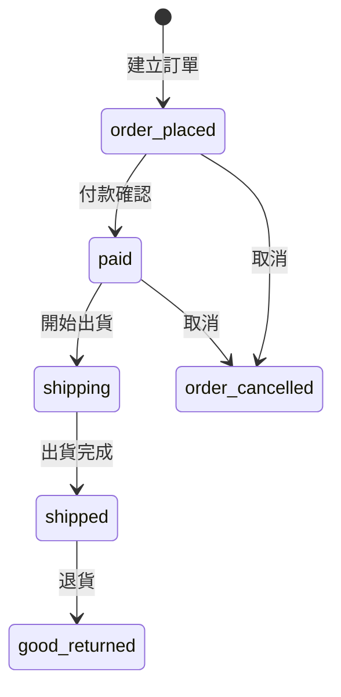

# 任天堂 amiibo 專賣（Demo）

以 Ruby on Rails 8 實作的全端電商網站，涵蓋完整購物流程、訂單狀態機管理與後台管理系統。
以 amiibo 商品為題材，練習從需求拆解到部署上線的完整開發流程。


---

## 🔗 Links

| | |
|---|---|
| 🌐 Live Demo | [jdstore20260510.onrender.com](https://jdstore20260510.onrender.com/) |
| 📁 GitHub | [github.com/a892842486/jdstore20260510](https://github.com/a892842486/jdstore20260510) |

> ⚠️ 部署於 Render 免費方案，首次開啟可能需要等待約 30 秒啟動。

## 🔑 Demo Account

| 角色 | Email | Password |
|------|-------|----------|
| Admin | admin@test.com | 123456 |

---

## Features

### Storefront（前台）
- 商品列表、詳情瀏覽
- 購物車管理（新增、修改數量、刪除）
- 結帳與訂單建立流程
- 訂單狀態追蹤與歷史查詢
- 使用者註冊 / 登入（Devise）
- Email 訂單通知（下單、出貨、取消）
- 中英文 i18n 多語系切換

### Admin Dashboard（後台）
- 商品 CRUD（含圖片上傳至 AWS S3）
- 訂單列表管理
- 訂單狀態流轉操作（付款確認、出貨、取消）

### Email Notifications（寄信通知）
使用 Action Mailer 實作：
- 下單通知信
- 出貨通知信
- 訂單取消通知
- 管理員取消申請通知
支援訂單資訊與 i18n 多語系信件標題。

### Order State Machine（AASM）

使用 AASM 實作訂單狀態管理，確保狀態流轉的合法性與業務邏輯一致性。



---

## Tech Stack
| 分類 | 技術 |
|------|------|
| Backend | Ruby on Rails 8、PostgreSQL |
| 認證 | Devise |
| 狀態機 | AASM |
| 信件 | Action Mailer |
| 檔案儲存 | Active Storage + AWS S3 |
| Frontend | Tailwind CSS |
| 部署 | Render |

---

## Screenshots

### Storefront

Homepage


Product Page


Shopping Cart


Checkout Page


Order Detail


Order History


### Admin Dashboard

Admin Dashboard


### Authentication

Login/Register


### Additional Features

Email Preview


i18n Preview


---

## ⚙️ Installation

### 環境需求

- Ruby 3.x（建議 3.2+）
- PostgreSQL
- Node.js（Tailwind CSS 編譯用）

### 步驟

```bash
git clone git@github.com:a892842486/jdstore20260510.git
cd jdstore20260510/jdstore
bundle install
```

### 啟動

```bash
rails db:create db:migrate db:seed
rails server
```

開啟 [http://localhost:3000](http://localhost:3000)
